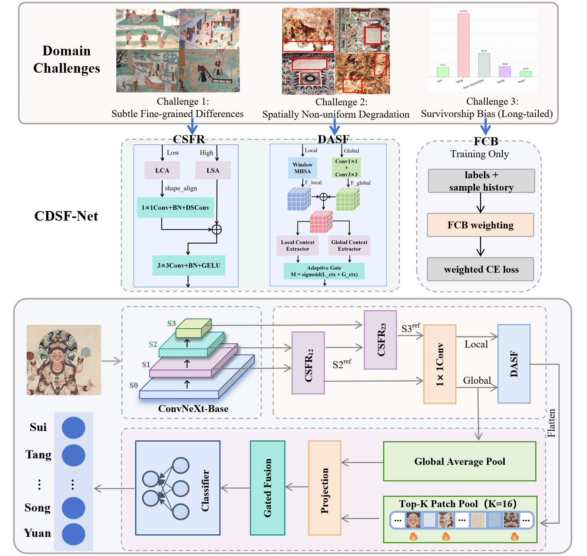

<div align="center">

# CDSF-Net

Core implementation of **CDSF-Net** for fine-grained dating of ancient murals.

ConvNeXt-Base backbone with `CSFR`, `DASF`, and `FCB`, organized into a clean standalone package for public release.

</div>

## Overview

This folder was extracted from the larger experiment workspace and keeps only the code needed for the main method.

- `CSFR`: Cross-Scale Feature Refinement for preserving subtle stylistic cues across feature levels
- `DASF`: Degradation-Adaptive Semantic Fusion for balancing local texture and global semantics
- `FCB`: forgetting-aware class balancing for long-tailed training
- two-stage training with optional pseudo labels

## Architecture

<p align="center">
  
</p>


## Dataset Layout

The training script expects image folders like:

```text
images/
├── 两晋十六国/
├── 北魏/
├── 西魏/
├── 北齐/
├── 北周/
├── 隋/
├── 唐代/
├── 五代/
├── 宋/
└── 元/
```

Optional pseudo-labeled data can be placed under:

```text
images_pseudo/<class_name>/*.jpg
```

## Quick Start

```bash
pip install -r requirements.txt
```

Train with:

```bash
python train.py \
  --data_dir images \
  --pseudo_root images_pseudo \
  --use_pseudo \
  --output_dir runs/cdsf_net
```

The script will automatically create a fixed split file under `splits/` if it does not already exist.

## What Is Included

- Main training entry: `train.py`
- Model definition: `models/cdsf_net.py`
- Dataset split and sampling utilities: `utils/data.py`
- Forgetting-aware balancing: `utils/losses.py`
- Evaluation metrics: `utils/metrics.py`

## Notes

- This package intentionally excludes raw data, checkpoints, training logs, and external backbone repositories.
- The public-facing code uses the paper terminology `CSFR / DASF / FCB` instead of the older internal experiment names.

## Citation

```bibtex
@article{wang2026cdsfnet,
  title={Fine-Grained Dating of Ancient Murals with Degradation Adaptation and Forgetting-Aware Long-Tail Learning},
  author={Jin Wang and Zheng Liu and Juan Wang and Xuelong Li and Yu Weng}
}
```
